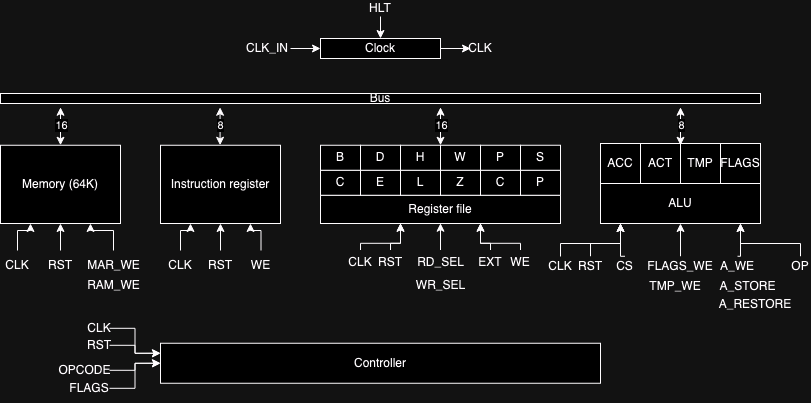
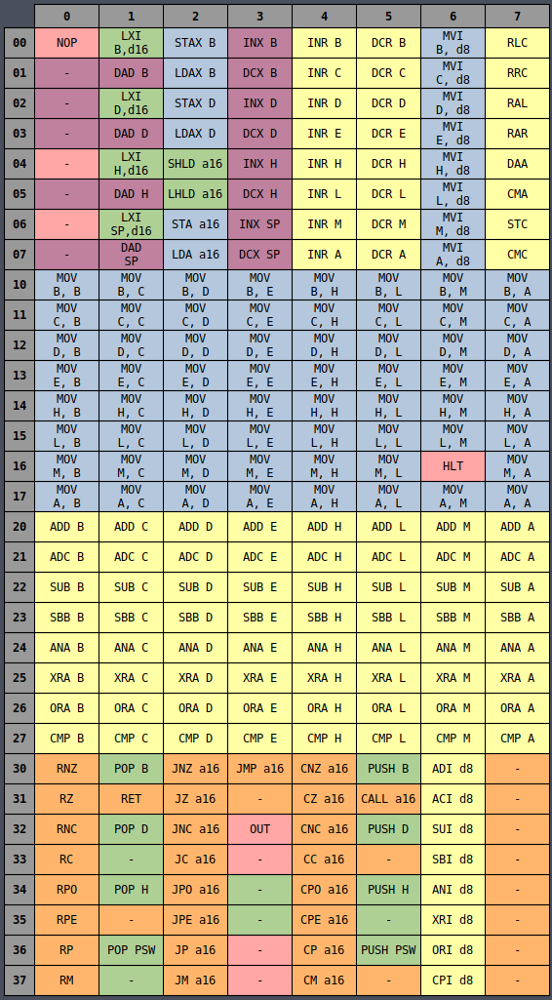

# nam85 documentation

This is a detailed documentation on how the nam85 works.

# Table of content

- [nam85 documentation](#nam85-documentation)
- [Table of content](#table-of-content)
- [Architecture](#architecture)
- [Clock module](#clock-module)
- [Bus](#bus)
- [Instruction register](#instruction-register)
- [Register file](#register-file)
- [ALU](#alu)
- [Memory (64K)](#memory-64k)
- [Instruction set](#instruction-set)
- [Instruction decoding](#instruction-decoding)
- [Later stages of different instructions](#later-stages-of-different-instructions)
  - [MOV destination register, source register](#mov-destination-register-source-register)
  - [MVI destination register, data byte](#mvi-destination-register-data-byte)
  - [Arithmetic and logic instructions](#arithmetic-and-logic-instructions)
  - [Other ALU operations](#other-alu-operations)
  - [ALU immediate operation](#alu-immediate-operation)
  - [Increment and Decrement](#increment-and-decrement)
  - [Increment and Decrement (16-bit)](#increment-and-decrement-16-bit)
  - [Load and Store](#load-and-store)
  - [Extended load immediate / Double add](#extended-load-immediate--double-add)
  - [Push and Pop](#push-and-pop)
  - [SHLD / LHLD instructions](#shld--lhld-instructions)
  - [JUMP instruction](#jump-instruction)
  - [CALL instruction](#call-instruction)
  - [RET instruction](#ret-instruction)
  - [Conditional jump, conditional call, conditional return](#conditional-jump-conditional-call-conditional-return)
  - [NOP instruction](#nop-instruction)
  - [HLT instruction](#hlt-instruction)
  - [OUT instruction](#out-instruction)

# Architecture
- This is an 8-bit computer implemented in FPGA



# Clock module
- Takes a clock signal and a halt signal. Output 0 if halt signal is high, else output clock signal

# Bus
- A 16-bit bus, used for communication across modules
- The bus will store data based on the modules output enable signals (the output enable signals will be asserted by the controller)
- The bus can store data from the register file, the memory, the ALU's ACC and the ALU's FLAGS

# Instruction register
- Holds the instruction being executed 
- If reset, write 0 into the IR
- If we (write enable), write data in the bus into the IR

# Register file
- Contains all 12 8-bit registers of this computer
- Half of the registers are programmer-accessible (B, C, D, E, H, L)
- These registers are extendable (meaning they can be combined to create 3 16-bit registers: BC, DE, HL)
- PC and SP are dedicated 16-bit registers for Program Counter and Stack Pointer. These are always 16-bit but they are represented as 2 8-bit register in Verilog
- W and Z are programmer-inaccessible as they are used for temporary data storage registers for certain instructions
- 5th bit of the `wr_sel` and `rd_sel` determines whether the registers should be treated as 16-bit extended or not. The other 4 bits are the address of the register (eg: 10000 means BC will be selected)
- There's a write enable input signal
- Takes in a 2-bit `ext` signal for performing 16-bit extended operations (16-bit increment, 16-bit decrement, 16-bit increment 2) for instructions like **INX** AND **DCX**. These go through the register file instead of the ALU as they should not affect the flags. The double increment is used for skipping over address bytes (usually used for conditional jumps)
- Registers addresses:
```binary
0000: B
0001: C
0010: D
0011: E
0100: H
0101: L
0110: W
0111: Z
1000: P
1001: C
1010: S
1011: P
```

# ALU
- Contain 4 8-bit registers for immediate data storage
- ACC is the accumulator, used for all operations. ACT is a temporary register used for temporarily storing data in ACC while the ACC does other operations. TMP is a temporary register used to store data to be operated on when an operation requires 2 operands. FLAGS is used to store the status of the previous operation  (Zero - Z, Carry - C, Parity - P, Sign - S). Some operations should not affect certain flags
- Takes in a store signal to know when to store ACC to ACT, a restore signal to know when to take ACT back to ACC, ACC write enable signal, TMP write enable signal, 5-bit operation signal to know which operation to perform, control signal to know when an operation need to be performed
- Flags will be set based on the value in ACC: C = 1 if ACC has 1 carry bit, Z = 1 if all 8 bits of ACC is 0, S = 1 if the MSB of ACC is 1, P = 1 if the number of 1s in ACC is even
- For the arithmetic and logic operations, all flags should be set as the operations can affect the ACC in many different ways. For the compare operation, only the zero flag should be set because 0 indicate equality (this will be used for jump instructions). For the increment and decrement instructions, all but the carry flag should be set. For the remaining operations (rotate, set carry, etc), only the carry flags should be set
- Supports these operations (Each of these operations have a 5-bit opcode. The opcodes start from 00000 for ADD and get added up by 1 for each of the following instructions):
	- ADD: Add ACC with TMP
	- ADC: Add ACC with TMP with carry bit  from previous operation
	- SUB: Sub TMP from ACC
	- SBB: Sub TMP and borrow bit from previous operation from ACC
	- ANA: And ACC with TMP
	- XRA: Xor ACC with TMP
	- ORA: Or ACC with TMP
	- CMP: Compare ACC with TMP to get the different between the 2
	- RLC: Set carry bit to MSB of ACC then shift ACC left
	- RRC: Set carry bit to LSB of ACC then shift ACC right
	- RAL: Set carry bit to MSB of ACC then shift ACC left and append the carry bit to LSB
	- RAR: Set carry bit to LSB of ACC then shift ACC right and append the carry bit to MSB
	- CMA: Perform 1's complement on ACC
	- STC: Set the carry bit to 1
	- CMC: Perform 1's complement on carry bit
	- INR: Increment ACC by 1
	- DCR: Decrement ACC by 1

# Memory (64K)
- Has 64K addresses (65536 addresses, each are 8-bit) and a 16-bit Memory address Register (MAR) to temporarily hold the address in the memory to be read or written to
- Initialize the memory with the program from a binary file
- Need MAR write enable signal to know when the MAR should take data from the bus
- Default memory mode will be read, the memory will take a write enable signal to know when it should write to the given memory address

# Instruction set
- This has the same instruction set as the Intel 8085 (with some instructions removed like IN and OUT)
- T states: The number of cycles required to complete the entire instruction
- M represents HL register (16-bit)
- Instructions: ZCSP 

> For details about the instructions supported by the nam85, check out [instructions.md](instructions.md)

Table (Hex representation):


Table (Octal representation):


# Instruction decoding
- Control signal will be asserted through a 33-bit control word
- Takes in an 8-bit opcode and 8-bit flag
- Stage will be a 4-bit register and there needs to be a stage reset signal
- First 3 stages for each instructions are the same: Grab next instruction from memory and write it into the program counter. 
- Stages four and beyond do different things depending on the instruction
- Use `casez` to check each instruction opcodes (use wildcard character `?` because some instructions have different opcode but similar operations)
- First 3 stages:
	- Stage 0: 
		- Access the PC register to get the instruction address
		- Assert register output enable
		- Assert MAR write enable
	- Stage 1:
		- Assert memory output enable (Read from address in MAR)
		- Assert instruction register write enable
	- Stage 2:
		- Access the PC register
		- Increment value in PC register (Extended increment)

# Later stages of different instructions
## MOV destination register, source register
- 1 byte
- The first 6 bits are for the destination and source registers
- First 3 bits are the source register opcode
- Middle 3 bits are the destination register opcode
- The control signals will be different for the `M` register as it is 16-bit (Octals are 1?6 and 16?)
- Register opcodes:

| Opcode | Register |
| ------ | -------- |
| 000    | B        |
| 001    | C        |
| 010    | D        |
| 011    | E        |
| 100    | H        |
| 101    | L        |
| 110    | M        |
| 111    | A (ACC)  |

- Stages for `M` register (`M` holds the memory address):

| Stage | As source (destination reg is middle 3 bits)                                                                                                                                                                                                                             | As destination (source reg is last 3 bits)                                                                                                                                                                                                     |
| ----- | ------------------------------------------------------------------------------------------------------------------------------------------------------------------------------------------------------------------------------------------------------------------------ | ---------------------------------------------------------------------------------------------------------------------------------------------------------------------------------------------------------------------------------------------- |
| 3     | - Access the HL register<br>- Assert register output enable (get HL's data)<br>- Assert MAR write enable (Store HL address in MAR)                                                                                                                                       | - Access the HL register<br>- Assert register output enable (Get HL's data)<br>- Assert MAR write enable (Store HL address in MAR)                                                                                                             |
| 4     | - If destination is A (ACC), assert ACC write enable<br>- Else, access destination register and assert register write enable (Get data from memory at HL address)<br>- Assert memory output enable (Access memory at HL address to ACC register)<br>- Assert stage reset | - If source is A (ACC), assert ACC output enable<br>- Else, access source register and assert register output enable (Get data from register)<br>- Assert memory write enable (Write data in to memory at HL location)<br>- Assert stage reset |

- Stages for other register:
	- Stage 3:
		- For the source:
			- If source is ACC:
				- Assert ACC output enable
			- Access the selected source register
			- Assert register output enable
		- For the destination:
			- If destination is ACC:
				- Assert ACC write enable
			- Access the selected destination register
			- Assert register write enable
		- Assert stage reset

## MVI destination register, data byte
- 2 bytes
- Middle 3 bits are the destination register opcode

- Stages for the `MVI M` instruction:
	- Stage 3 (Getting the address of the data to be written):
		- Access value of Program Counter (get address of data to be written)
		- Assert register output enable 
		- Assert MAR write enable
	- Stage 4 (Access the data to be written in memory and temporarily store it in W register):
		- Assert memory output enable (get data to be written)
		- Access the W register (for temporary data storage)
		- Assert register write enable
	- Stage 5 (Get location that HL is pointing to):
		- Select the HL register (get address of HL location for writing data)
		- Assert register output enable
		- Assert MAR write enable
	- Stage 6 (Output data stored in W register to memory location):
		- Access the W register
		- Assert register output enable
		- Assert memory write enable
	- Stage 7 (Increment PC to move to the next instruction):
		- Access the PC register
		- Assert extended increment
		- Assert stage reset

- Stages for the `MVI` with other registers:
	- Stage 3 (Getting the address of the data to be written):
		- Access value of Program Counter (get address of data to be written)
		- Assert register output enable 
		- Assert MAR write enable
	- Stage 4 (Check if destination is ACC):
		- If ACC, assert ACC write enable
		- Else, access destination register and assert register write enable
		- Assert memory output enable (Write data to register)
	- Stage 5 (Increment PC to move to the next instruction):
		- Access the PC register
		- Assert extended increment
		- Assert stage reset

## Arithmetic and logic instructions
- ADD, ADC, SUB, SBB, ANA, XRA, ORA, CMP
- 1 byte
- First 3 bits are the register opcode
- Middle 3 bits are the ALU operation opcode

- Stages for `M` register:
	- Stage 3 (Access memory at address HL):
		- Access value of HL (address)
		- Assert register output enable
		- Assert MAR write enable
	- Stage 4 (Store value in memory to TMP register):
		- Assert memory output enable
		- Assert TMP write enable
	- Stage 5 (Perform ALU operations):
		- Assert ALU control signal
		- Assert 5-bit ALU operation signal (since we're only doing the arithmetic and logic instructions, the first 2 bits will be 0. The last 3 bits are the middle 3 bits from opcode)
		- Assert stage reset

- Stages for other registers:
	- Stage 3 (Access and store register):
		- If ACC:
			- Assert ALU control signal
			- Assert 5-bit ALU operation signal (since where only doing the arithmetic and logic instructions, the first 2 bits will be 0. The last 3 bits are the middle 3 bits from opcode)
			- Assert stage reset
		- Else:
			- Access source register 
			- Assert register output enable
		- Store data from accessed register to TMP
	- Stage 4 (Perform ALU operations):
		- Assert ALU control signal
		- Assert 5-bit ALU operation signal (since we're only doing the arithmetic and logic instructions, the first 2 bits will be 0. The last 3 bits are the middle 3 bits from opcode)
		- Assert stage reset

## Other ALU operations
- RLC, RRC, RAL, RAR, DAA (Unsupported), CMA, STC, CMC
- 1 byte
- Middle 3 bits are the ALU operation opcode

| Operation | Opcode |
| --------- | ------ |
| RLC       | 000    |
| RRC       | 001    |
| RAL       | 010    |
| RAR       | 011    |
| DAA       | 100    |
| CMA       | 101    |
| STC       | 110    |
| CMC       | 111    |

- Stages:
	- Stage 3:
		- Assert ALU control signal
		- Assert 5-bit ALU operation signal (since we're only doing the arithmetic and logic instructions, the first 2 bits will be 01. The last 3 bits are the middle 3 bits from opcode)
		- Assert stage reset

## ALU immediate operation
- ADI, ACI, SUI, SBI, ANI, XRI, ORI, CPI
- 2 bytes
- Middle 3 bits are the ALU operation opcode

| Operation | Opcode |
| --------- | ------ |
| ADI       | 000    |
| ACI       | 001    |
| SUI       | 010    |
| SBI       | 011    |
| ANI       | 100    |
| XRI       | 101    |
| ORI       | 110    |
| CPI       | 111    |

- Stages:
	- Stage 3 (Get address from Program Counter):
		- Access register PC (get address of the data to be operated on)
		- Assert register output enable
		- Assert MAR write enable
	- Stage 4 (Get data from memory location):
		- Assert memory output enable
		- Assert TMP write enable
	- Stage 5 (Perform ALU operation):
		- Assert ALU control signal
		- Assert 5-bit ALU operation signal (since we're only doing the arithmetic and logic instructions, the first 2 bits will be 0. The last 3 bits are the middle 3 bits from opcode)
		- Access register PC (for incrementing)
		- Assert extended increment (for incrementing PC to next instruction)
		- Assert stage reset

## Increment and Decrement
- 1 byte
- Middle 3 bits are the source register opcode
- The LSB will indicate whether it's in increment or decrement mode (0 is INR, 1 is DCR)

- Stages for the `INR M` / `DCR M` instruction:
	- Stage 3 (Access memory at location HL):
		- Access value of HL (get address)
		- Assert register output enable
		- Assert MAR write enable
	- Stage 4 (Get data from memory at location HL):
		- Assert memory output enable (get data from location HL)
		- Assert ACT store signal
		- Assert ACC write enable signal
	- Stage 5 (Determine whether to increment or decrement):
		- Assert ALU control signal
		- Pass the increment / decrement opcode (`1000` + LSB of current instruction) into the ALU opcode input path
	- Stage 6 (Output ALU result):
		- Assert ALU output enable
		- Assert ACT restore signal
		- Assert memory write enable
		- Assert stage reset

- Stages for the `INR` / `DCR` for the other registers:
	- Stage 3 (Bring register data into the ALU):
		- If ACC:
			- Assert ALU control signal
			- Pass the increment / decrement opcode (`1000` + LSB of current instruction) into the ALU opcode input path
			- Assert stage reset
		- Else:
			- Access source register 
			- Assert register output enable
			- Assert ACT store signal
			- Assert ACC write enable
	- Stage 4 (Assert ALU control signal and pass opcode into ALU):
		- Assert ALU control signal
		- Pass the increment / decrement opcode (`1000` + LSB of current instruction) into the ALU opcode input path
	- Stage 5 (Output ALU result):
		- Assert ALU output enable
		- Assert ACT restore signal
		- Access the source register
		- Assert register write enable
		- Assert stage reset

## Increment and Decrement (16-bit)
- 1 byte
- Can only access B, D, H and SP registers
- Middle 2 bits (bit 5:4 in Verilog) are the destination register opcode
- The 3rd bit will decide whether the operation will be increment or decrement
- This will operate in the register file module
- Layout of `INX` / `DCX`:
```
INX B: 03 (0000_0011)
DCX B: 0B (0000_1011)

INX D: 13 (0001_0011)
DCX D: 1B (0001_1011)

INX H: 23 (0010_0011)
DCX H: 2B (0010_1011)

INX SP: 33 (0011_0011)
DCX SP: 3B (0011_1011)
```
- Opcode for registers (5:4 bits in Verilog):

| Register | Opcode |
| -------- | ------ |
| B        | 00     |
| D        | 01     |
| H        | 10     |
| SP       | 11     |

- Stages for `INX` / `DCX`:
	- Stage 3: 
		- If register opcode is 11 (SP), access SP (because SP's opcode has a different middle 2 bit compared to B, D and H - special case)
		- Else, create register file 5-bit read select signal: bit 10 + opcode of register + bit 0 (example: 10100 will access HL in extended mode - MSB indicates extended mode)
		- Create extended operation signal based on the 3rd bit of the register opcode (0 means increment, 1 means decrement)
		- Assert stage reset

## Load and Store 
- Load and store X will only operate on B and D (Store content of ACC into address BC or DE / Load content of BC or DE into ACC)
- Load and store will take in a 16-bit address (Store content of ACC into address / Load content of address into ACC)
- 3rd bit in opcode will determine load or store (0 is store, 1 is load)
- Bit 5:4 in Verilog determines the register or a 16-bit address

| Register / Data | Opcode |
| --------------- | ------ |
| B               | 00     |
| D               | 01     |
| 16-bit address  | 11     |

- Stages for load and store:
	- Stage 3 (Get address of the 1st byte of address from PC):
		- Access register PC (get 1st byte of address of the data to be operated on)
		- Assert register output enable
		- Assert MAR write enable
	- Stage 4 (Getting and storing 1st byte of data from memory at PC location):
		- Assert memory output enable
		- Access register Z (for temporarily storing data)
		- Assert register write enable
	- Stage 5 (Increment PC to get the next byte because this is a 16-bit address):
		- Access register PC
		- Assert extended increment
	- Stage 6 (Get address of the 2nd byte of address from PC):
		- Access register PC (get 2nd byte of address of the data to be operated on)
		- Assert register output enable
		- Assert MAR write enable
	- Stage 7 (Getting and storing 2nd byte of data from memory at PC location):
		- Assert memory output enable
		- Access register W (for temporarily storing data)
		- Assert register write enable
	- Stage 8 (Increment PC to the next instruction):
		- Access register PC
		- Assert extended increment
	- Stage 9 (Output address stored in WZ):
		- Access register WZ
		- Assert register output enable
		- Assert MAR write enable
	- Stage 10 (Check if store or load):
		- If store (Opcode 3rd bit == 0):
			- Assert ALU output enable
			- Assert memory write enable
		- If load (Opcode 3rd bit == 1):
			- Assert ACC write enable
			- Assert memory output enable
		- Assert stage reset

- Stages for Load / Store X:
	- Stage 3 (Store first byte of address - B or D):
		- Assert register access signal (since we're accessing only B and D in non-extended mode, first 2 bits will be 0, then the 2 register opcode, then finally the last bit will be 0)
		- Assert register output enable
		- Access register W
		- Assert register write enable
	- Stage 4 (Store second byte of address - C or E):
		- Assert register access signal (since we're accessing only B and D in non-extended mode, first 2 bits will be 0, then the 2 register opcode, then finally the last bit will be 1)
		- Assert register output enable
		- Access register Z
		- Assert register write enable
	- Stage 5 (Access memory at location WZ):
		- Access register WZ
		- Assert register output enable
		- Assert MAR write enable
	- Stage 6 (Check if load or store):
		- If store (Opcode 3rd bit == 0):
			- Assert ALU output enable
			- Assert memory write enable
		- If load (Opcode 3rd bit == 1):
			- Assert ACC write enable
			- Assert memory output enable
		- Assert stage reset

## Extended load immediate / Double add
- 3 bytes for LXI, 1 byte for DAD
- These 2 are in the same group because of the table
- LXI will load a 16-bit value into a specified extended register
- DAD will add a specified extended register data with the data in HL
- 3rd bit in opcode will determine load or add (0 is LXI, 1 is DAD)
- Bit 5:4 in Verilog determines the extended register to use

| Register | Opcode |
| -------- | ------ |
| B        | 00     |
| D        | 01     |
| H        | 10     |
| SP       | 11     |

- Stages of `LXI`:
	- Stage 3 (Get address of 1st byte from PC):
		- Access register PC (get 1st byte of address of the data to be operated on)
		- Assert register output enable
		- Assert MAR write enable
	- Stage 4 (Store 1st byte of data):
		- Assert memory out
		- Access register Z
		- Assert register write enable
	- Stage 5 (Increment PC to the address of the 2nd byte to get):
		- Access register PC
		- Assert extended increment
	- Stage 6 (Get address of 2nd byte from PC):
		- Access register PC (get 2nd byte of address of the data to be operated on)
		- Assert register output enable
		- Assert MAR write enable
	- Stage 7 (Store 2nd byte of data):
		- Assert memory out
		- Access register W
		- Assert register write enable
	- Stage 8 (Load data into extended register):
		- If SP:
			- Access register SP (Because the SP opcode is different from the opcode in this section)
		- Else:
			- Assert 5-bit register access signal in write mode (since we're using extended registers in register file, the first 2 bit will be 10 because MSB need to be 1 to be extended, then the 2 register opcode bits of the register to use, then a 0 bit)
		- Access register WZ in read mode
		- Assert register output enable
		- Assert register write enable
	- Stage 9 (Increment PC to next instruction):
		- Access register PC
		- Assert extended increment

- Stages of `DAD` (Load the 1st byte (L) into ACC and add it with the 1st byte of the data, then load the 2nd byte (H) into ACC and add it with carry with 2nd byte of the data):
	- Stage 3 (Get 1st byte of HL):
		- Access register L
		- Assert register output enable
		- Assert ACT store
		- Assert ACC write enable
	- Stage 4 (Get 1st byte of the other register):
		- If SP:
			- Access register P
		- Else:
			- Assert 5-bit register access signal (since we're using non-extended registers in register file, the first 2 bit will be 00, then the 2 register opcode bits of the register to use, then a 1 bit to access the lower byte. eg: BC will access C)
		- Assert register output enable
		- Assert TMP write enable
	- Stage 5 (ALU add):
		- Assert ALU control signal
		- Assert opcode `00000` (ADD opcode)
	- Stage 6 (Write result into register Z):
		- Access register Z
		- Assert register write enable
		- Assert ALU output enable
	- Stage 7 (Get 2nd byte of HL):
		- Access register H
		- Assert register output enable
		- Assert ACC write enable
	- Stage 8 (Get 1st byte of the other register):
		- If SP:
			- Access register S
		- Else:
			- Assert 5-bit register access signal (since we're using non-extended registers in register file, the first 2 bit will be 00, then the 2 register opcode bits of the register to use, then a 0 bit to access the lower byte. eg: BC will access B)
		- Assert register output enable
		- Assert TMP write enable
	- Stage 9 (ALU add with carry):
		- Assert ALU control signal
		- Assert opcode `00001` (ADC opcode)
	- Stage 10 (Write result into register W):
		- Access register W
		- Assert register write enable
		- Assert ALU output enable
		- Assert ACT restore
	- Stage 11 (Rewrite result into HL):
		- Access register HL in write mode
		- Assert write enable
		- Access register WZ in read mode
		- Assert output enable
		- Assert stage reset

## Push and Pop
- 1 byte
- Can use 4 registers: B, D, H, PSW
- PSW means push or pop the ACC and the flags in the stack
- First 3 bits ([2:0]) determines whether to use `POP` or `PUSH`
- Bits 5:4 determine the register to use
- Opcode for first 3 bits:

| Operation | Opcode |
| --------- | ------ |
| POP       | 001    |
| PUSH      | 101    |

- Opcode for register:

| Register | Opcode |
| -------- | ------ |
| B        | 00     |
| D        | 01     |
| H        | 10     |
| PSW      | 11     |

- Stages of `PUSH`:
	- Stage 3 (Make space on the SP):
		- Access register SP
		- Assert extended decrement
	- Stage 4 (Access SP on memory):
		- Access register SP
		- Assert register output enable
		- Assert MAR write enable
	- Stage 5 (Get and put ACC or 2nd byte of register value on the stack):
		- If PSW:
			- Assert ALU output enable
		- Else:
			- Assert 5-bit register select signal (first 2 bit is 0, then the 5:4 bits, then a final 0 bit)
			- Assert register output enable
		- Assert memory write enable
	- Stage 6 (Decrement SP to make space for the flags):
		- Access register SP
		- Assert extended decrement
	- Stage 7 (Access SP on memory):
		- Access register SP
		- Assert register output enable
		- Assert MAR write enable
	- Stage 8 (Get and put flags or 1st byte of register value on the stack):
		- If PSW:
			- Assert ALU flags output enable
		- Else:
			- Assert 5-bit register select signal (first 2 bit is 0, then the 5:4 bits, then a final 1 bit)
			- Assert register output enable
		- Assert memory write enable
		- Assert stage reset

- Stages of `POP`:
	- Stage 3 (Access memory at SP to get data stored on the stack):
		- Access register SP
		- Assert register output enable
		- Assert MAR write enable
	- Stage 4 (Get and output flags or 1st byte of register value from stack to register):
		- If PSW:
			- Assert ALU flags write enable
		- Else:
			- Assert 5-bit register select signal (first 2 bit is 0, then the 5:4 bits, then a final 1 bit)
			- Assert register write enable
		- Assert memory output enable
	- Stage 5 (Move to next value in stack):
		- Access register SP
		- Assert extended increment
	- Stage 6 (Access memory at SP to get data stored on the stack):
		- Access register SP
		- Assert register output enable
		- Assert MAR write enable
	- Stage 7 (Get and output ACC or 2nd byte of register value from stack to register):
		- If PSW:
			- Assert ACC write enable
		- Else:
			- Assert 5-bit register select signal (first 2 bit is 0, then the 5:4 bits, then a final 0 bit)
			- Assert register write enable
		- Assert memory output enable
	- Stage 8 (Clear popped data in stack):
		- Access register SP
		- Assert extended increment
		- Assert stage reset

## SHLD / LHLD instructions
- 3 bytes
- Store / Load H and L direct
- SHLD stores H and L at specified address
- LHLD loads H and L with value at specified address
- The 4th byte of the opcode (3rd index) determines which instruction to use (0 means SHLD, 1 means LHLD)

- Stages:
	- Stage 3 (Get address of 1st byte of address):
		- Access register PC
		- Assert register output enable
		- Assert MAR write enable
	- Stage 4 (Store 1st byte of address):
		- Access register Z
		- Assert memory output enable
		- Assert register write enable
	- Stage 5 (Move to 2nd byte of address):
		- Access register PC
		- Assert extended increment
	- Stage 6 (Get address of 2nd byte of address):
		- Access register PC
		- Assert register output enable
		- Assert MAR write enable
	- Stage 7 (Store 2nd byte of address):
		- Access register W
		- Assert memory output enable
		- Assert register write enable
	- Stage 8 (Move PC to next instruction):
		- Access register PC
		- Assert extended increment
	- Stage 9 (Get data of the address stored in WZ):
		- Access register WZ
		- Assert register output enable
		- Assert MAR write enable
	- Stage 10 (Check which instruction to use):
		- If SHLD:
			- Access register H
			- Assert register output enable
			- Assert memory write enable
		- If LHLD:
			- Access register H
			- Assert register write enable
			- Assert memory output enable
	- Stage 11 (Move to next byte which is stored at WZ + 1):
		- Access register WZ
		- Assert extended increment
	- Stage 12 (Get data of the new address stored in WZ):
		- Access register WZ
		- Assert register output enable
		- Assert MAR write enable
	- Stage 13 (Check which instruction to use):
		- If SHLD:
			- Access register L
			- Assert register output enable
			- Assert memory write enable
		- If LHLD:
			- Access register L
			- Assert register write enable
			- Assert memory output enable
		- Assert stage reset

## JUMP instruction
- 3 bytes
- JMP jumps to a 16-bit address in the memory
- Get the address in the opcode and set PC to that address

- Stages:
	- Stage 3 (Get address of the 1st byte of address):
		- Access register PC
		- Assert register output enable
		- Assert MAR write enable
	- Stage 4 (Temporarily store the 1st byte to Z):
		- Access register Z
		- Assert register write enable
		- Assert memory output enable
	- Stage 5 (Increment PC to the 2nd byte):
		- Access register PC
		- Assert extended increment
	- Stage 6 (Get address of the 2nd byte of address):
		- Access register PC
		- Assert register output enable
		- Assert MAR write enable
	- Stage 7 (Temporarily store the 2nd byte to W):
		- Access register W
		- Assert register write enable
		- Assert memory output enable
	- Stage 8 (Change PC value to WZ):
		- Access register PC in write mode
		- Assert register write enable
		- Access register WZ in read mode
		- Assert register output enable
		- Assert stage reset

## CALL instruction
- 3 bytes
- Jumps to a 16-bit address in memory and push a return address to the stack
- The stack is at the bottom of the memory. It starts from `FFFF`
- Since the stack will grow downwards, we use decrement to grow the stack
- Get the address in the opcode, store return address to stack and set PC to that address

- Stages:
	- Stage 3 (Get address of the 1st byte of address):
		- Access register PC
		- Assert register output enable
		- Assert MAR write enable
	- Stage 4 (Temporarily store the 1st byte to Z):
		- Access register Z
		- Assert register write enable
		- Assert memory output enable
	- Stage 5 (Increment PC to the 2nd byte):
		- Access register PC
		- Assert extended increment
	- Stage 6 (Get address of the 2nd byte of address):
		- Access register PC
		- Assert register output enable
		- Assert MAR write enable
	- Stage 7 (Temporarily store the 2nd byte to W):
		- Access register W
		- Assert register write enable
		- Assert memory output enable
	- Stage 8 (Increment PC to next instruction):
		- Access register PC
		- Assert extended increment
	- Stage 9 (Decrement SP to store 1st byte of return address):
		- Access register SP
		- Assert extended decrement
	- Stage 10 (Access SP location in memory):
		- Access register SP
		- Assert register output enable
		- Assert MAR write enable
	- Stage 11 (Store 1st byte of PC into SP):
		- Access register C
		- Assert register output enable
		- Assert memory write enable
	- Stage 12 (Decrement SP to store 2nd byte of return address):
		- Access register SP
		- Assert extended decrement
	- Stage 13 (Access SP location in memory):
		- Access register SP
		- Assert register output enable
		- Assert MAR write enable
	- Stage 14 (Store 2nd byte of PC into SP):
		- Access register P
		- Assert register output enable
		- Assert memory write enable
	- Stage 15 (Rewrite PC with WZ):
		- Access PC in write mode
		- Assert register write enable
		- Access WZ in read mode
		- Assert register output enable
		- Assert stage reset

## RET instruction
- 1 byte
- Jumps to address stored on the stack and pop the stack (increment stack pointer)

- Stages:
	- Stage 3 (Get address of the 2nd byte of old PC value stored in SP):
		- Access register SP
		- Assert register output enable
		- Assert MAR write enable
	- Stage 4 (Store 2nd byte of old PC value in SP to W):
		- Access register W
		- Assert register write enable
		- Assert memory output enable
	- Stage 5 (Move to the 1st byte of old PC value in SP):
		- Access register SP
		- Assert extended increment
	- Stage 6 (Get address of the 1st byte of old PC value stored in SP):
		- Access register SP
		- Assert register output enable
		- Assert MAR write enable
	- Stage 7 (Store 1st byte of old PC value in SP to Z):
		- Access register Z
		- Assert register write enable
		- Assert memory output enable
	- Stage 8 (Bring SP pointer to the position before the CALL):
		- Access register SP
		- Assert extended increment
	- Stage 9 (Rewrite PC with WZ):
		- Access PC in write mode
		- Assert register write enable
		- Access WZ in read mode
		- Assert register output enable
		- Assert stage reset

## Conditional jump, conditional call, conditional return
- 3 bytes
- Perform jump, call, return based on status flags
- First 3 bytes ([2:0]) will determine whether to jump, to call or to return
- Opcode for each of the 3 operations:

| Operation | Opcode |
| --------- | ------ |
| Return    | 000    |
| Jump      | 010    |
| Call      | 100    |

- The 4th byte (3rd index) will determine if the instruction is a "do" if flag is set or unset (0 means unset, 1 means set). We'll call this set bit
- The 5th and 6th bytes ([5:4]) will determine which flag to use
- Opcode for the flag bytes:

| Flag | Opcode |
| ---- | ------ |
| Z    | 00     |
| C    | 01     |
| P    | 10     |
| S    | 11     |

- Stages of conditional jump:
	- Stage 3 (Check if the conditions meet):
		- If flag does not equal to set bit (does not meet condition):
			- Access register PC
			- Assert extended increment 2 to skip the bytes of the instruction (since the instruction is 3 bytes long)
			- Assert stage reset 
		- Else:
			- Access register PC
			- Assert register output enable
			- Assert MAR write enable
	- Stage 4 (Get the 1st byte of address):
		- Access register Z
		- Assert register write enable
		- Assert memory output enable
	- Stage 5 (Increment PC to next byte):
		- Access register PC
		- Assert extended increment
	- Stage 6 (Access address of the 2nd byte of address):
		- Access register PC
		- Assert register output enable
		- Assert MAR write enable
	- Stage 7 (Get the 2nd byte of address):
		- Access register W
		- Assert register write enable
		- Assert memory output enable
	- Stage 8 (Rewrite PC with WZ):
		- Access register WZ in read mode
		- Assert register output enable
		- Access register PC in write mode
		- Assert register write enable
		- Assert stage reset

- Stages of conditional call:
	- Stage 3 (Check if the conditions meet):
		- If flag does not equal to set bit (does not meet condition):
			- Access register PC
			- Assert extended increment 2 to skip to the next instruction (since the instruction is 3 bytes long)
			- Assert stage reset 
		- Else:
			- Access register PC
			- Assert register output enable
			- Assert MAR write enable
	- Stage 4 (Get the 1st byte of address):
		- Access register Z
		- Assert register write enable
		- Assert memory output enable
	- Stage 5 (Increment PC to next byte):
		- Access register PC
		- Assert extended increment
	- Stage 6 (Access address of the 2nd byte of address):
		- Access register PC
		- Assert register output enable
		- Assert MAR write enable
	- Stage 7 (Get the 2nd byte of address):
		- Access register W
		- Assert register write enable
		- Assert memory output enable
	- Stage 8 (Increment PC to next instruction):
		- Access register PC
		- Assert extended increment
	- Stage 9 (Decrement SP to store return address):
		- Access register SP
		- Assert extended decrement
	- Stage 10 (Get SP current address to write to):
		- Access register SP
		- Assert register output enable
		- Assert MAR write enable
	- Stage 11 (Put the 1st byte of PC - C - to SP):
		- Access register C
		- Assert register output enable
		- Assert memory write enable
	- Stage 12 (Decrement SP to store the next byte):
		- Access register SP
		- Assert extended decrement
	- Stage 13 (Get SP current address to write to):
		- Access register SP
		- Assert register output enable
		- Assert MAR write enable
	- Stage 14 (Put the 2nd byte of PC - P - to SP):
		- Access register P
		- Assert register output enable
		- Assert memory write enable
	- Stage 15 (Rewrite PC with WZ):
		- Access register WZ in read mode
		- Assert register output enable
		- Access register PC in write mode
		- Assert register write enable
		- Assert stage reset

- Stages of conditional return:
	- Stage 3 (Check if the conditions meet):
		- If flag does not equal to set bit (does not meet condition):
			- Assert stage reset 
		- Else:
			- Access register SP
			- Assert register output enable
			- Assert MAR write enable
	- Stage 4 (Get 2nd byte of address to return to):
		- Access register W
		- Assert register write enable
		- Assert memory output enable
	- Stage 5 (Increment SP to next byte):
		- Access register SP
		- Assert extended increment
	- Stage 6 (Access SP in memory to get the next byte):
		- Access register SP
		- Assert register output enable
		- Assert MAR write enable
	- Stage 7 (Get 1st byte of address to return to):
		- Access register Z
		- Assert register write enable
		- Assert memory output enable
	- Stage 8 (Increment SP to remove the previous byte):
		- Access register SP
		- Assert extended increment
	- Stage 9 (Rewrite PC with WZ):
		- Access register WZ in read mode
		- Assert register output enable
		- Access register PC in write mode
		- Assert register write enable
		- Assert stage reset

## NOP instruction
- 1 byte
- Assert stage reset (No extra stages)

## HLT instruction
- 1 byte
- Halt program execution

- Stages:
	- Stage 3:
		- Assert halt signal

## OUT instruction
- 1 byte
- Outputs ACC value

- Stages:
	- Stage 3:
		- Access register PC
		- Assert extended increment
		- Assert display signal
		- Assert stage reset
